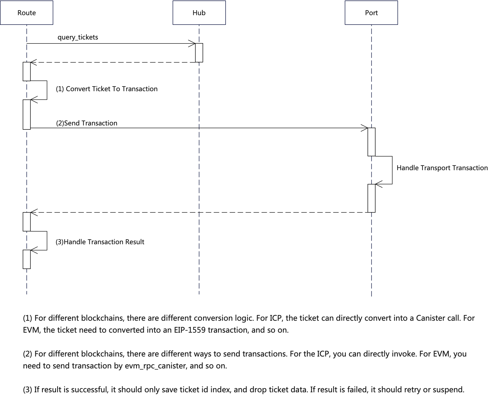
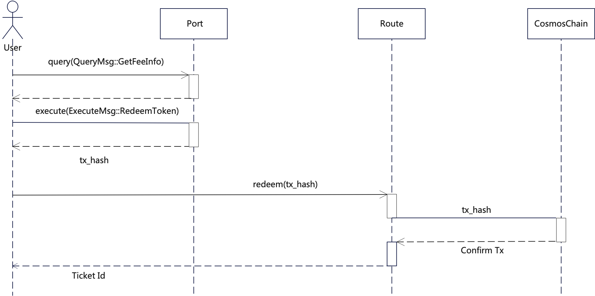

# Omnity Cosmwasm Port

This is a cosmwasm contract and Omnity cross-chain system docking, mainly responsible for:

1. Receive directives from Omnity system and execute it. There are several types of directives:

```rust
#[cw_serde]
pub enum Directive {
    AddChain(Chain),
    AddToken(Token),
    UpdateChain(Chain),
    UpdateToken(Token),
    ToggleChainState(ToggleState),
    UpdateFee(Factor),
}
```

2. Receive the Omnity system Mint request and use the Token Factory module mint token.
3. The Redeem interface allows users to destroy the Token and send a TxHash to the Omnity system to initiate a cross-chain.

# High Level Design

## Omnity Transport



## Omnity Redeem



## Testnet Deploy Cli
```Shell

# 部署合约
$ osmosisd tx wasm store target/wasm32-unknown-unknown/release/omnity_port_cosmos.wasm \
--keyring-backend test \
--from bob \
--gas-prices '0.1uosmo' \
--gas 'auto' \
--gas-adjustment 1.3 \
--output json \
-b sync \
--chain-id osmo-test-5 \
--node https://rpc.testnet.osmosis.zone:443 \
-y


# Get code_id from last transaction logs in MintScan
$ CODE_ID=xxx

# Specify osmosis account id of Omnity Route
$ INIT='{"route": "osmo1et3ewldnpeemgfrzf96ekraang64tzw8swfhxw"}'

$ osmosisd tx wasm instantiate "$CODE_ID" "$INIT" --keyring-backend test \
--label "omnity port" \
--from bob \
--gas-prices '0.1uosmo' \
--gas 'auto' \
--gas-adjustment 1.2 \
--home ~/.osmosisd \
--chain-id osmo-test-5 \
--node https://rpc.testnet.osmosis.zone:443 \
-b sync \
--no-admin \
-y

ADDTOKEN='{"exec_directive":{"seq":1,"directive":{"add_token":{"token_id":"Bitcoin-runes-HOPE.YOU.GET.RICH","name":"HOPE.YOU.GET.RICH","decimals":2, "symbol": "rich", "metadata": {}}}}}'
$ osmosisd tx wasm execute "$CONTRACT_ADDRESS" "$ADDTOKEN" \
--keyring-backend test \
--from bob \
--gas-prices '1uosmo' \
--gas 'auto' \
--gas-adjustment 1.2 \
--home ~/.osmosisd \
--node https://rpc.testnet.osmosis.zone:443 \
--chain-id osmo-test-5 \
-b sync \
-y

# Query if add token successfully
$ osmosisd query tokenfactory denoms-from-creator "$CONTRACT_ADDRESS" --node https://rpc.testnet.osmosis.zone:443

$ MINTTOKEN='{"privilege_mint_token": {"ticket_id": "111999", "token_id":"ckbtc", "receiver": "osmo1et3ewldnpeemgfrzf96ekraang64tzw8swfhxw", "amount": "1000"}}'

$ osmosisd tx wasm execute "$CONTRACT_ADDRESS" "$MINTTOKEN" \
--keyring-backend test \
--from bob \
--gas-prices '1uosmo' \
--gas 'auto' \
--gas-adjustment 1.2 \
--home ~/.osmosisd \
--node https://rpc.testnet.osmosis.zone:443 \
--chain-id osmo-test-5 \
-b sync \
-y

$ osmosisd query bank balance $RECEIVER factory/osmo10qt8wg0n7z740ssvf3urmvgtjhxpyp74hxqvqt7z226gykuus7eqxj2v4d/HOPE.YOU.GET.RICH


```